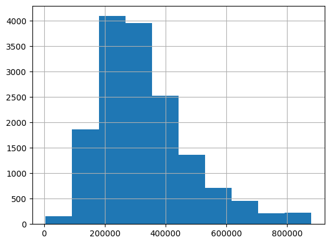

# **Immo Price Predictor**

## **Description**  
This project focuses on predicting real estate prices in Belgium using regression techniques, primarily Decision Tree and Random Forest models. The dataset is sourced from immoweb.be and includes essential property features like locality, property type, subtype, price, and more. It emphasizes data cleaning, feature engineering, and model evaluation using an Object-Oriented Programming (OOP) approach.
Learning objectives:
- be able to apply a regression model in a real context;
- be able to preprocess data for machine learning.

## **Structure of the Folders and Files**

### **Project Structure**  

Immo_ML/  
├── .venv                               # Virtual environment  
├── data/                               # Contains datasets (input and output)  
│   ├── immoweb_data_cleaned.csv        # Main dataset after cleaning  
│   ├── immoweb_data_processed.csv      # Final prepared dataset  
│   ├── zips.csv                        # Region code (zips) data  
├── notebooks/                          # Notebooks  
│   ├── cleaning.ipynb                  # Notebook data cleaning and feature preparation  
│   ├── decision_tree.ipynb             # Notebook for building decision tree  
│   ├── random_forest.ipynb             # Notebook for building random forest  
├── scripts/                            # Python scripts  
│   ├── data_preparation.py             # Handles data cleaning and feature preparation  
│   ├── decision_tree.py                # Training and evaluation of models  
│   ├── random_forest.py                # Heatmaps and performance visuals  
├── results/                            # Model performance outputs and plots  
│   ├── train_vs_test.png               # Scatter plot of predicted vs actual prices (train set)  
│   ├── predicted_vs_actual.png         # Scatter plot of predicted vs actual prices (test set)  
├──.gitignore		                # System file  
├──presentation.md                      # Presentation of Project  
└──README.md                            # Project documentation  

## **Installation**  
1. Clone the Repository  
        git clone https://github.com/FomAndrii/Immo_ML.git  
        cd Immo_ML  

2. Set Up a Virtual Environment  
        python3 -m venv venv  
        source venv/bin/activate       # On Windows, use `venv\Scripts\activate`  

3. Install Black is the uncompromising Python code formatter  

        pip install black  

Before finishing project I have checked Jupiter notebooks and .py files with the Black.  
All done! ✨ 🍰 ✨  
4 files reformatted, 3 files left unchanged.  

## **Usage**  

1. Prepare the Dataset  
Ensure the raw data is placed in the data/ folder. Run the following command to clean and preprocess the data:  

        python scripts/data_preparation.py  

2. Build Decision Tree Model with Visualization  
Train and evaluate the decision tree regression model:  

        python scripts/decision_tree_analysis.py  

3. Build Random Forest Model with Visualization  
Train and evaluate the decision tree regression model:  

        python scripts/random_forest_analysis.py  

4. View Results
Check the results in the results/ folder for visualizations and performance metrics.  

## **Visuals**  

****  

****

****

****

****

## **Contributors**  
**Andrii Fomichov:** BeCode learner, code implementor and lead of data preprocessing.  
**Joen Cheramy:** Coaching and feedback.  

## **Timeline**  
**Day 1:** Data collection, cleaning, and preprocessing.  
**Day 2-3:** Feature engineering, correlation analysis, and dummy variable creation.  
**Day 4:** Model training, evaluation, and visualization.  
**Day 5-6** Documentation, optimization, and project presentation.  

**Personal Situation**  
This project is part of an AI Bootcamp focused on mastering regression techniques and applying them to real-world data.    
It reflects a hands-on learning approach to integrating machine learning principles with practical coding and data science workflows.  

We welcome contributions and feedback! If you have any questions or suggestions, please feel free to reach out or submit a pull request.
