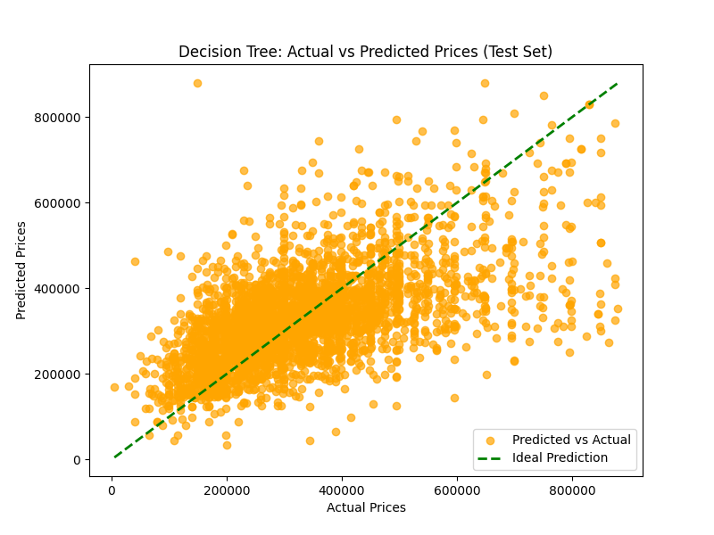
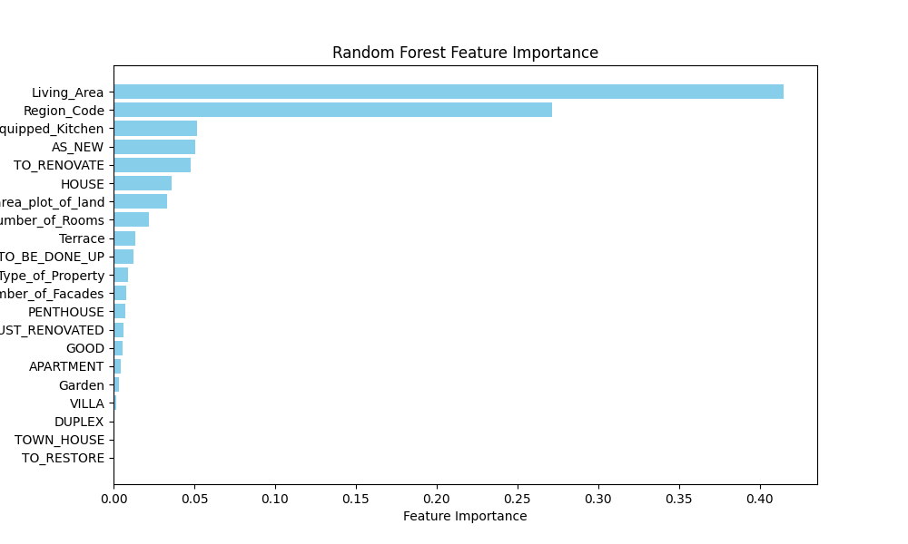

# Decision Tree and Random Forest for Predicting Real Estate Prices

## 1. Learning Objectives

- Be able to apply a regression model (such as Decision Tree and Random Forest) in a real-world context.
- Be able to preprocess data for machine learning, including data cleaning, feature engineering and formatting.

## 2. The Mission

The real estate company "ImmoEliza" has requested that you create a machine learning model using Decision Tree and Random Forest algorithms to predict the prices of real estate properties in Belgium. Your task is to build a predictive model that can forecast property prices based on various features such as the type of property, number of rooms, surface area, and more.

## 3. Must-have Features

### Step 1: Data Cleaning
Before I started using the dataset for machine learning, I need to preprocess the data:
- I had 16.631,00 rows in 16 Columns
- I had in dataset the next dtypes:
    - 5 objects;
    - 4 integers;
    - 7 floats.

### Step 2: Features Engineering
I wanted to change categorical data (municipality and province) to numeric (Brussels Capital -1, Flanders -2, Wallonia -3).  
To do this, I add a new dataset (zip.csv), clean this dataset and merge it with the main dataset.  

As a result I received the dataset without NaN and categorical data with the next structure: 15.555,00 raws in 40 Columns. It happened after merging dummies data from 'Subtype_of_Property' (17 columns) and 'State_of_the_Building' (5 columns).

My target was a Price and others variables were as a features (39 features were tested in different ways and chosen the best four for modelling)

### Step 3: Data Formatting
Once the data was cleaned and new features are created, I needed to format it for machine learning:

- **Divide the dataset into training and testing sets**: This is a crucial step. I divided my data into two parts: one for training the model (X_train, y_train) and another for testing and evaluating the model's performance (X_test, y_test). I tried two variants: 0.22 (1/5) and 0.33 (1/3).

### Step 4: Model Selection
I have been assigned to work with regression algorithms, and specifically, Decision Trees and Random Forests.

- **Decision Tree**: A decision tree is a simple yet powerful model that splits data into subsets based on feature values. It creates a tree-like structure where each node represents a feature, and branches represent possible values or ranges of that feature. It's easy to interpret, but it can overfit if the tree is too deep.

- **Random Forest**: Random Forest is an ensemble of decision trees. It builds multiple decision trees with random subsets of features and samples, then aggregates their predictions. Random Forest is less prone to overfitting than a single decision tree and typically provides better performance.

### Step 5: Apply Your Model:

1. Train the model using the training data (`X_train`, `y_train`).
2. Use the trained model to predict prices for the test data (`X_test`).
3. Evaluate the model's performance by comparing predicted prices to actual prices.

### Step 6: Model Evaluation
Once my models were applied, evaluate its performance using appropriate metrics. For regression models like Decision Tree and Random Forest, typical evaluation metrics include:

- **R² (Coefficient of Determination)**: Measures how well the model explains the variance in the data. A value closer to 1 indicates a better fit.
  
- **Mean Squared Error (MSE)**: Measures the average squared difference between the predicted and actual values. Lower values indicate better performance.
  
- **Root Mean Squared Error (RMSE)**: The square root of MSE, which provides an interpretable metric in the same units as the target variable (price, in this case).
  
- **Mean Absolute Error (MAE)**: Measures the average absolute differences between predicted and actual values, providing a sense of the model's average error.

**The Decision Tree Model showed the next data:**
**Training Set Performance:**
*R² Score: 0.4610856873098689*  
*Mean Squared Error (MSE): 12220071488.587204*  
*Root Mean Squared Error (RMSE): 110544.43219170834*  
*Mean Absolute Error (MAE): 80249.05879262238*  

**Testing Set Performance:**
*R² Score: 0.36041596837416723*  
*Mean Squared Error (MSE): 14018524590.981222*  
*Root Mean Squared Error (RMSE): 118399.85046857627*  
*Mean Absolute Error (MAE): 86860.86971330237*  

  
  

### **Summary:**
The Model of Decision Tree is suboptimal for the following reasons:

The low R² score (0.36) suggests the model explains only one third portion of the variability in Price.  
The test-size 0.22 gives better result.  
The high RMSE and MAE values indicate significant prediction errors, making the model unsuitable for accurate price predictions.  
**Potential Issues:**  
**Data Quality:** there may be outliers or noise in the data (e.g., extreme Price values) that affect model performance.  
**Model Complexity:** the Decision Tree model might be overfitting or underfitting due to inappropriate parameter settings.  

**The Random Forest Model showed the next data:**
**Training Set Performance:**
*R² Score: 0.5557598892245861*  
*Mean Squared Error (MSE): 10073300678.682955*  
*Root Mean Squared Error (RMSE): 100365.83422003205*  
*Mean Absolute Error (MAE): 72321.4973339466*  

**Testing Set Performance:**
*R² Score: 0.5050437364164431*  
*Mean Squared Error (MSE): 10848545631.866943*  
*Root Mean Squared Error (RMSE): 104156.3518555971*  
*Mean Absolute Error (MAE): 75687.4478682724*  

  
  
  

**Summary and Insights:**
1. **Overfitting:** The model performs significantly better on the training set (higher R²) than on the testing set, suggesting overfitting. The model may have learned the training data too well, capturing noise or irrelevant patterns that don't generalize well to new data.

2. **Performance:** The model's performance is moderate overall, with R² values around 50-55% for both the training and testing sets. The RMSE and MAE indicate relatively large prediction errors, meaning there is room for improvement in terms of accuracy.

**Some Steps to Improve:**
Tune Hyperparameters: Consider tuning the hyperparameters of the Random Forest (such as n_estimators, max_depth, min_samples_split, and min_samples_leaf) to improve the model's performance. You can use GridSearchCV or RandomizedSearchCV for hyperparameter optimization.

**Questions to Consider**:
- How could you improve the model’s performance?  
The main approaches to improve the model`s performance are:  
1) try to scrab new dataset with the biggest data;
2) avoid overfitting model;
3) work better in the preprocessing (try to save data from one side, but make its cleaner, from another side);
4) try to find the best features for every model;
5) try Tune Hyperparameters

- Which part of the process (data cleaning, feature engineering, model selection) has the most impact on the results?  
All parts of the process are string important for project, especially data cleaning and feature engineering. You should be attentive in data cleaning and creative in data engineering.

- How should you divide your time working on this kind of project to maximize efficiency and model performance?  
I would say that the most efficient time management in projects like this should be:
- **15-20%:** Data collection, cleaning, and preprocessing.
- **15-20%:** Feature engineering, correlation analysis, and dummy variable creation.
- **20-30%:** Model training, evaluation, and visualization.
- **30 %:** Documentation, optimization, and project presentation.
